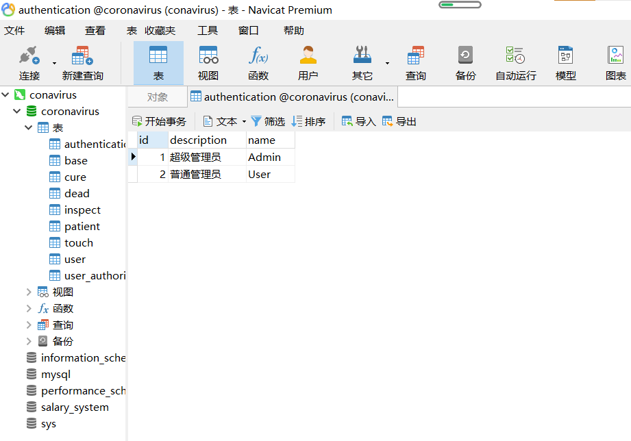
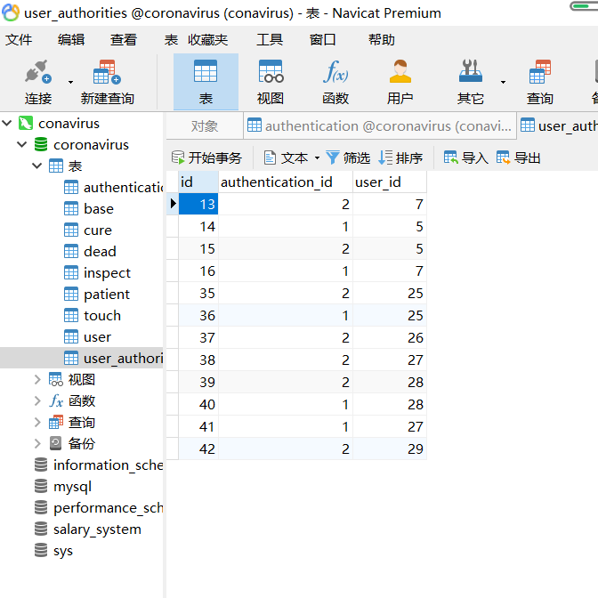
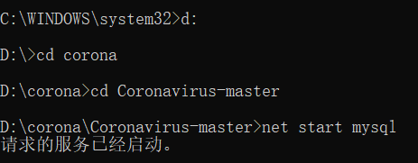

# Coronavirus
## 已对原作者的相关功能进行完善（原作者账号：Sanley）
基于SpringBoot及thymeleaf搭建的疫情信息管理系统
疫情信息管理系统旨在通过信息化手段记录跟踪本地区密切接触者、受感染者、危重症病人、治愈者以及死亡者，以密切接触者为开始一直到感染者治愈或者死亡，记录其基本信息、感染源、核算记录以及发病情况等信息，在通过信息化可视化手段展示本地区疫情发展情况，统计各个人群的数量，每个人群所占比例。

本系统的技术环境为： JDK1.8 SpringMvc SpringSecurity SpringBoot Mysql Mybatis Thymeleaf  echarts

# 新增说明（一、二、三）
## 一、管理员功能已完善
已解决超级管理员设置问题
## 二、数据库个别表解析

上图为权限表

上表为权限分配表

## 三、链接数据库方法
* 以管理员身份运行命令行窗口
* 打开项目所在目录
* 运行net start mysql

如上图，数据库启动成功（里面已经存在一些我的验证数据）
紧接着就可以用自己的DBMS进行可视化操作数据库了
（附上初始本地测试地址：localhost：8008）

